# 🛒 E-Commerce API

## 👨‍💻 Authors

- Carpio, Lyndel J.
- Cebuano, Irene A.

---

# Laboratory 7 - HTTP Fundamentals and Spring Boot

## 📌 Project Overview

This project is a RESTful API built using Spring Boot for our Laboratory 7. It simulates a simple e-commerce backend where products can be created, viewed, updated, and deleted.

The goal of this project is to demonstrate:

- HTTP methods (GET, POST, PUT, DELETE)
- REST API design
- Proper status codes
- In-memory data storage (no database)

---

## ⚙️ Technologies Used

- Java 25
- Spring Boot 4.0.5
- Spring Web
- Lombok
- Gradle

---

## 🚀 How to Run the Application

1. Open the project in IntelliJ or VSCode
2. Make sure Java 25 is installed
3. Run the application:

```bash
./gradlew bootRun
```

4. Open browser or Postman:

```
http://localhost:8080/api/products
```

---

## 📡 API Endpoints

| Method | Endpoint | Description | Status Code |
|--------|----------|-------------|-------------|
| GET | `/api/products` | Get all products | 200 OK |
| GET | `/api/products/{id}` | Get product by ID | 200 OK / 404 |
| POST | `/api/products` | Create new product | 201 Created |
| PUT | `/api/products/{id}` | Update product | 200 OK / 404 |
| DELETE | `/api/products/{id}` | Delete product | 204 No Content |
| GET | `/api/products/filter/category?category={name}` | Filter by category | 200 OK |
| GET | `/api/products/filter/price?min={min}&max={max}` | Filter by price | 200 OK |

### Sample POST Request

```json
{
  "name": "Laptop",
  "description": "Gaming laptop",
  "price": 50000,
  "category": "Electronics",
  "stockQuantity": 10,
  "imageUrl": "https://example.com/laptop.jpg"
}
```

---

## 🧪 Testing

The API was tested using Postman.

Test cases performed:

- Created at least 3 products
- Retrieved all products
- Retrieved product by ID
- Updated product using PUT
- Deleted product
- Filtered products by category and price
- Tested invalid ID (returns 404)

### Testing Screenshots

#### Create Product (POST)
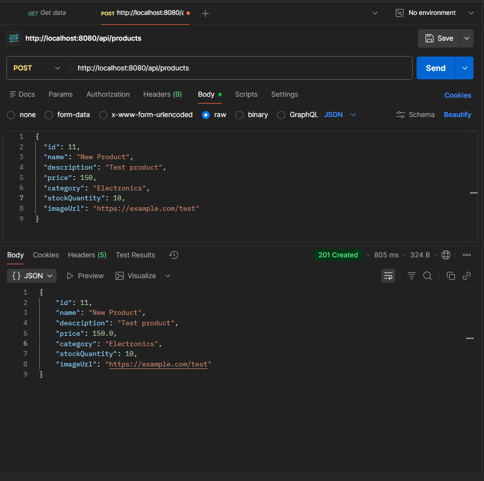

#### Get All Products (GET)
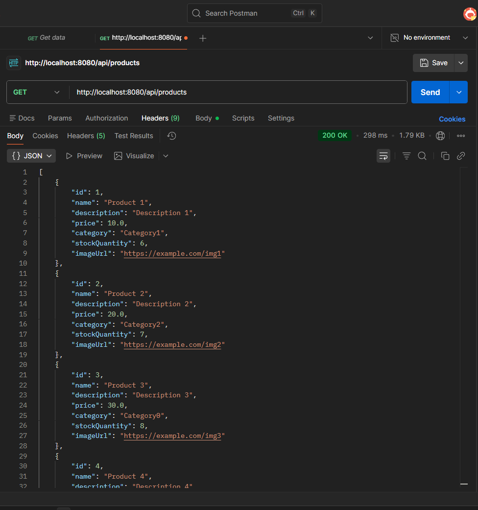

#### Get Product by ID (GET)
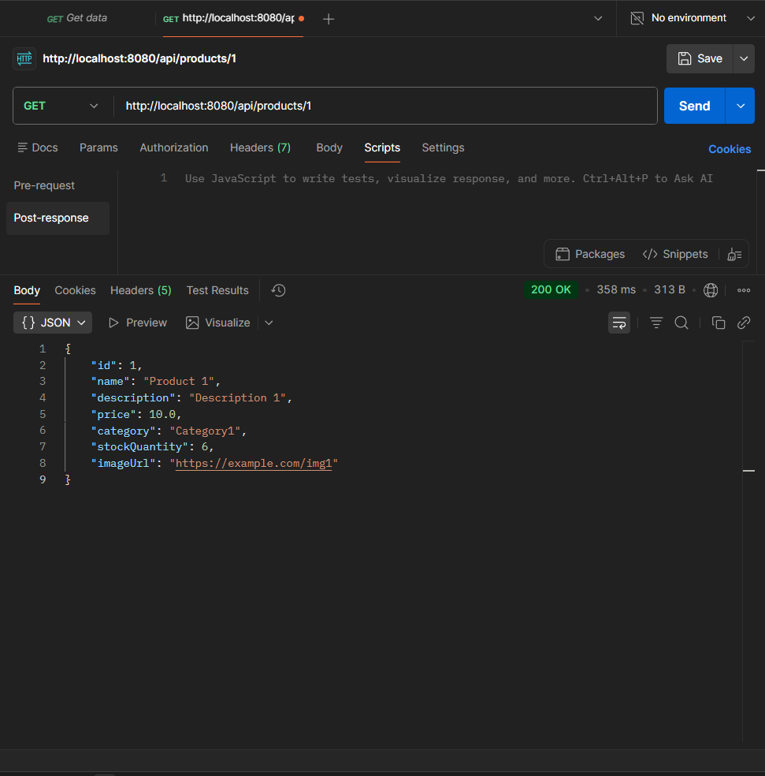

#### Update Product (PUT)


#### Delete Product (DELETE)
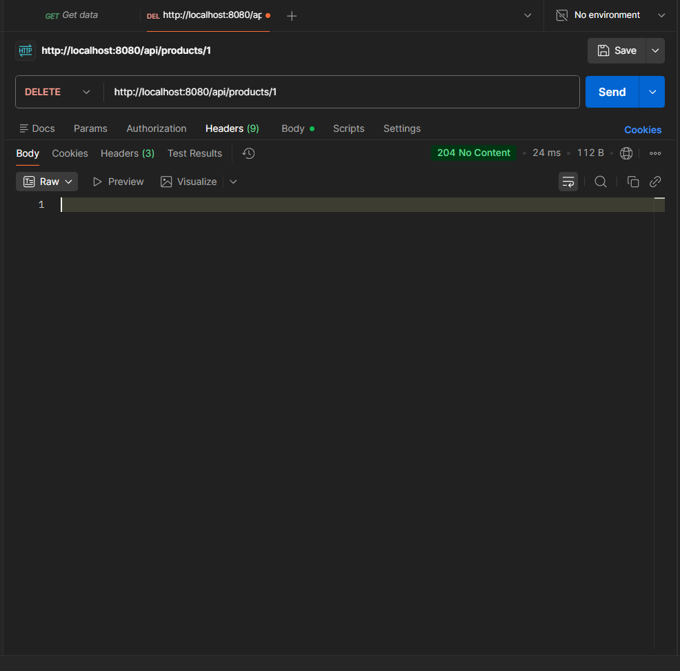

#### Filter by Category
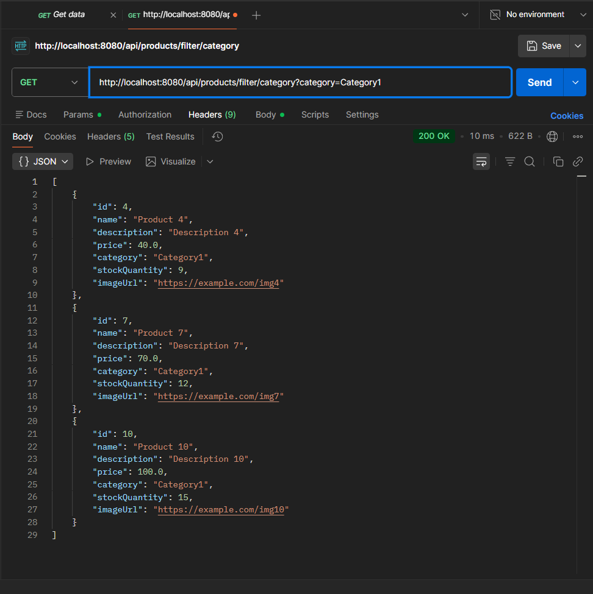

#### Filter by Price
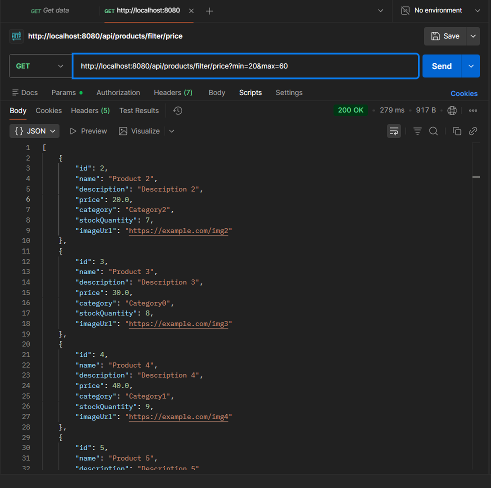

#### Error Handling (404)


---

## ⚠️ Limitations

- Uses in-memory storage (data resets when application restarts)
- No database integration
- No authentication

---

## ✅ Conclusion

This project successfully implements a RESTful API based on the requirements of Laboratory 7. All CRUD operations and filtering features are working properly.

---
#
#
#

# Laboratory 8 - Database Integration and Fetch API

## 📌 Project Overview

This project is a **full-stack e-commerce application** built with Spring Boot and a **MySQL database**. The backend provides a RESTful API with persistent data storage using Spring Data JPA and Hibernate. The frontend consumes these endpoints dynamically using the **Fetch API**.

The goal of this project is to demonstrate:

- HTTP methods (GET, POST, PUT, DELETE, PATCH)
- REST API design with proper status codes
- **Database integration with JPA/Hibernate**
- **Frontend – Backend communication via Fetch API**
- **Asynchronous JavaScript with error handling**
- **Responsive design (mobile-first)**
- **Data persistence (unlike Lab 7)**

---

## ⚙️ Technologies Used

| Backend | Frontend | Database |
|---------|----------|----------|
| Java 25 | HTML5 | MySQL |
| Spring Boot 4.0.5 | CSS3 | Hibernate (JPA) |
| Spring Web | JavaScript (ES6) | |
| Spring Data JPA | Fetch API | |
| Lombok | | |
| Gradle | | |

---

## 🗄️ Database Schema

The database `ecommerce_db` contains the following tables:

| Table | Description |
|-------|-------------|
| `products` | Product details (id, name, price, category, stock, imageUrl) |
| `categories` | Product categories (one-to-many with products) |
| `orders` | Customer orders (one-to-many with order_items) |
| `order_items` | Line items within an order (many-to-one with orders and products) |

### Entity Relationships

```
Category (1) ──┬── (*) Product
               │
Order (1) ─────┴── (*) OrderItem ── (*) Product (1)
```

All relationships use JPA annotations (`@OneToMany`, `@ManyToOne`) with appropriate cascade and fetch strategies.

### Database Screenshot

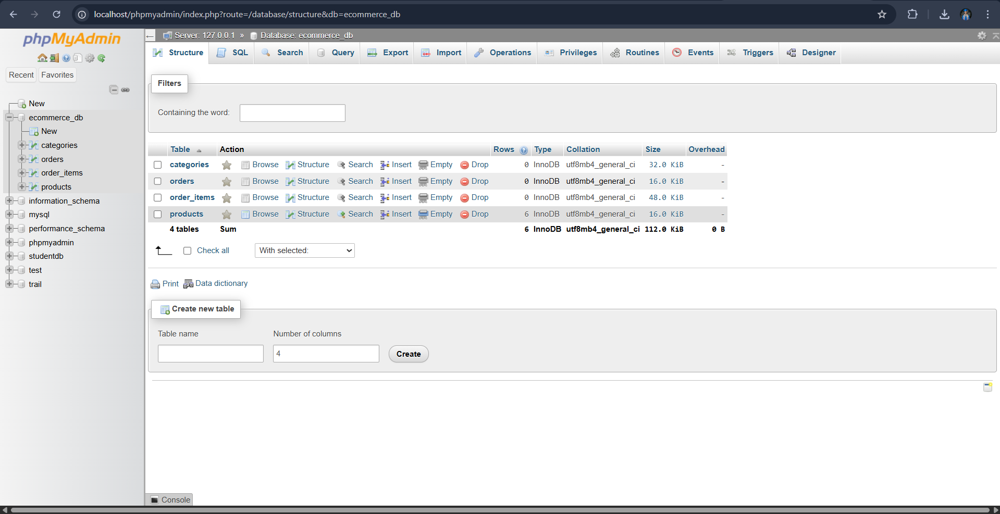

---

## 🚀 How to Run the Application 

### Prerequisites

- Java 21 or higher (Java 25 also works)
- MySQL (XAMPP recommended)
- Git (optional)

### Step-by-step

1. **Clone the repository**

```bash
git clone https://github.com/carpiolyndel/ecommerceapi.git
cd ecommerceapi
```

2. **Start MySQL** (via XAMPP Control Panel)

3. **Create the database**

```sql
CREATE DATABASE ecommerce_db;
```

4. **Configure database connection**  
   Edit `src/main/resources/application.properties`:

```properties
spring.datasource.url=jdbc:mysql://localhost:3306/ecommerce_db?useSSL=false&serverTimezone=UTC
spring.datasource.username=root
spring.datasource.password=
spring.datasource.driver-class-name=com.mysql.cj.jdbc.Driver
spring.jpa.hibernate.ddl-auto=update
spring.jpa.show-sql=true
```

5. **Run the backend**

```bash
./gradlew bootRun
```

6. **Open the frontend** in your browser:

```
http://localhost:8080
```

---

## 📡 API Endpoints (Lab 8)

All endpoints are prefixed with `/api/products`.

| Method | Endpoint | Description | Status Codes |
|--------|----------|-------------|--------------|
| GET | `/api/products` | Get all products | 200 OK |
| GET | `/api/products/{id}` | Get product by ID | 200 OK, 404 |
| POST | `/api/products` | Create new product | 201 Created, 400 |
| PUT | `/api/products/{id}` | Full update | 200 OK, 404 |
| PATCH | `/api/products/{id}` | Partial update | 200 OK, 404 |
| DELETE | `/api/products/{id}` | Delete product | 204 No Content, 404 |
| GET | `/api/products/filter/category?category={name}` | Filter by category | 200 OK |
| GET | `/api/products/filter/price?min={min}&max={max}` | Filter by price range | 200 OK |
| GET | `/api/products/filter/name?name={keyword}` | Filter by name | 200 OK |

### Sample POST Request

```json
{
  "name": "OFF! Overtime",
  "description": "Long-lasting protection",
  "price": 12.99,
  "category": "spray",
  "stockQuantity": 100,
  "imageUrl": "/images/download.jpg"
}
```

### Sample GET Response

```json
[
  {
    "id": 1,
    "name": "OFF! Overtime",
    "price": 12.99,
    "category": "spray",
    "stockQuantity": 100,
    "imageUrl": "/images/download.jpg"
  }
]
```

---

## 🎨 Frontend Features (Fetch API)

- **Dynamic product listing** on landing page and products page (data fetched from database)
- **Product detail page** with specifications and reviews
- **Shopping cart** using `localStorage` (persists across browser sessions)
- **Checkout form** with client-side validation
- **Order history** stored in `localStorage` and displayed on account page
- **Responsive design** – works on desktop, tablet, and mobile
- **Error handling** – user-friendly messages when backend is unreachable

---

## 🧪 Testing

### Backend Testing (cURL)

All endpoints were tested manually. The server was **restarted multiple times** to confirm data persistence (unlike Lab 7).

```bash
# Create a product
curl -X POST http://localhost:8080/api/products -H "Content-Type: application/json" -d '{"name":"OFF! Overtime","price":12.99,"category":"spray","stockQuantity":100}'

# Get all products
curl http://localhost:8080/api/products

# Filter by category
curl "http://localhost:8080/api/products/filter/category?category=spray"
```

### Database Testing

The screenshot below shows that products are **stored in MySQL database** and persist after server restart.


### Frontend Testing (Browser)

#### Desktop View

Products load from database on page load.

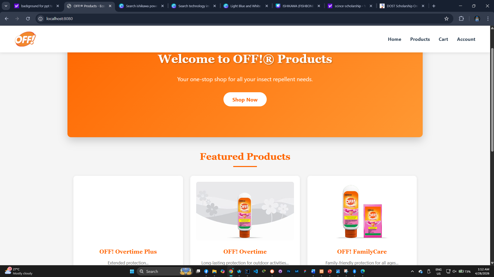

#### Mobile View (Responsive)

The website is responsive and works on mobile devices.

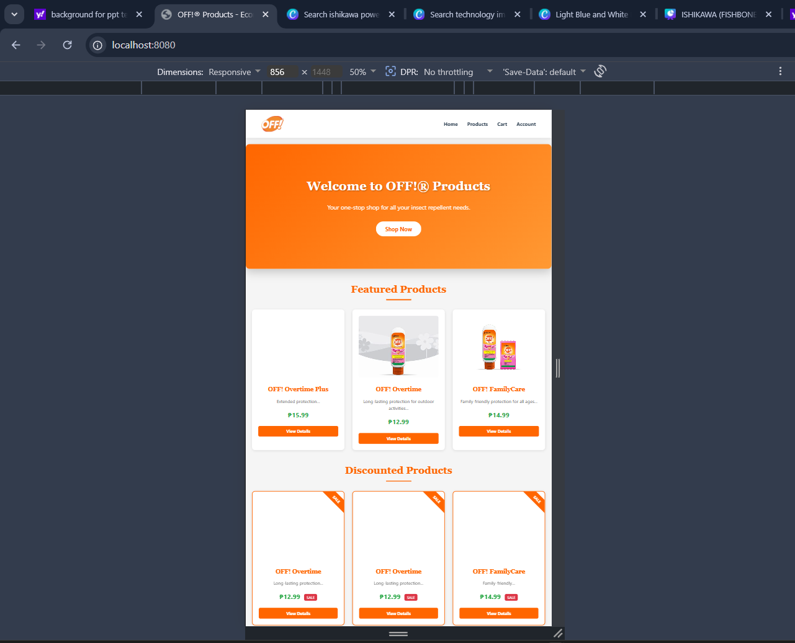

#### Cart Page

Add to cart functionality works correctly.

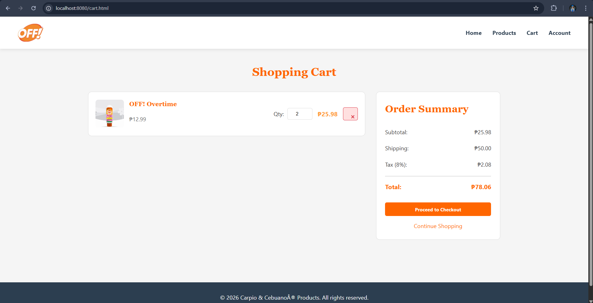

#### Browser Console

No errors in console only the icon.

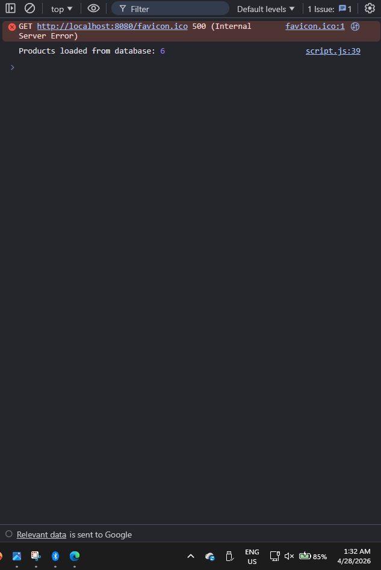

### Database Product Testing

Product display in Database.

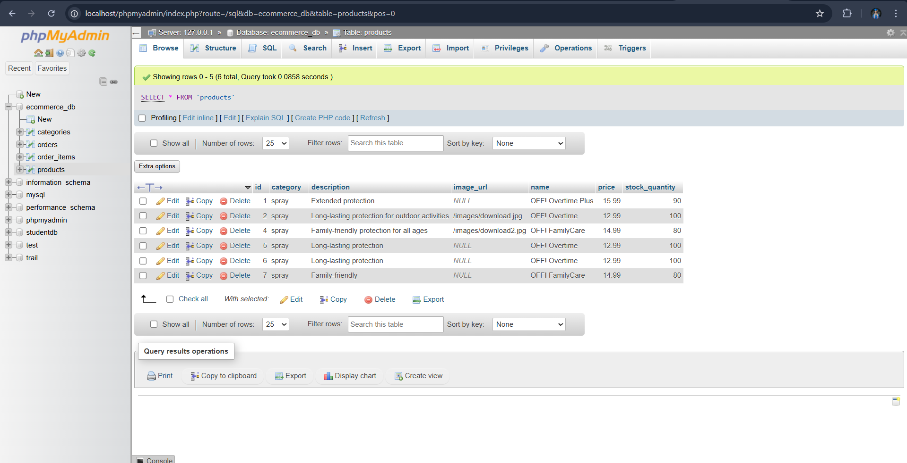

### Checkout Page

Display the checkout page with product.

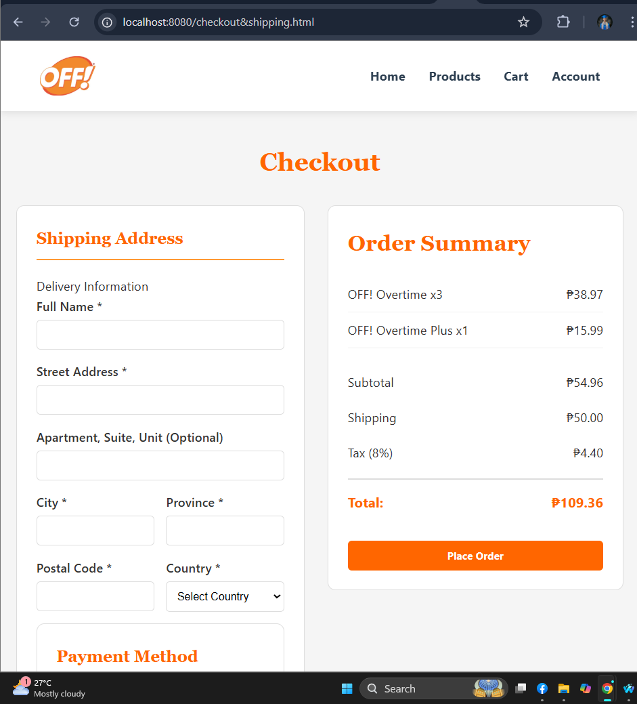


### Add to Cart Function

Add to cart button with displaying Function.
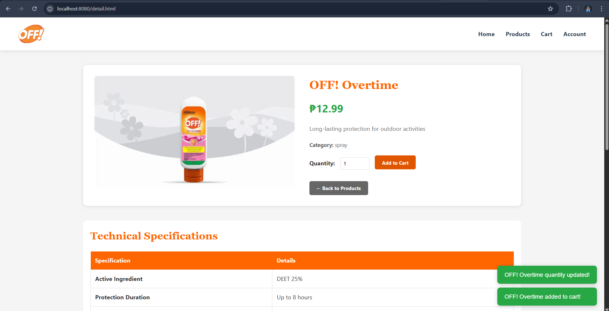

### Responsive Design Test

| Device | Screen Size | Columns | Status |
|--------|-------------|---------|--------|
| Desktop | >768px | 3-4 columns | ✅ |
| Tablet | 481-768px | 2 columns | ✅ |
| Mobile | <480px | 1 column | ✅ |

---

## 📊 Comparison: Lab 7 vs Lab 8

| Feature | Lab 7 | Lab 8 |
|---------|-------|-------|
| Storage | In-memory (List) | MySQL Database |
| Data Persistence | ❌ Lost on restart | ✅ Permanent |
| Frontend | ❌ None | ✅ HTML/CSS/JS with Fetch API |
| Cart | ❌ None | ✅ localStorage |
| PATCH Method | ❌ Not implemented | ✅ Implemented |
| Filter by Name | ❌ None | ✅ Implemented |
| CORS | ❌ Not configured | ✅ Configured |

---

## 📝 Notes

- **Unlike Lab 7, data persists after server restart** because it's stored in MySQL
- The frontend uses **Fetch API** with `async/await` and proper error handling (`try/catch`, checking `response.ok`)
- CORS is configured globally (`CorsConfig.java`) to allow requests from `http://localhost:8080`
- All JPA entities have Javadoc comments
- JavaScript functions contain inline comments explaining the logic

---

## ✅ Conclusion

This project successfully completes

- ✅ Backend migrated from in-memory storage to MySQL using Spring Data JPA
- ✅ REST API supports full CRUD + filtering
- ✅ Frontend consumes API via Fetch API, replacing static arrays
- ✅ Cart, checkout, and order history are implemented client-side
- ✅ Application is responsive and free of CORS/console errors
- ✅ All required screenshots and documentation are provided

---

## 🔗 GitHub Repository

[https://github.com/carpiolyndel/ecommerceapi](https://github.com/carpiolyndel/ecommerceapi)

---