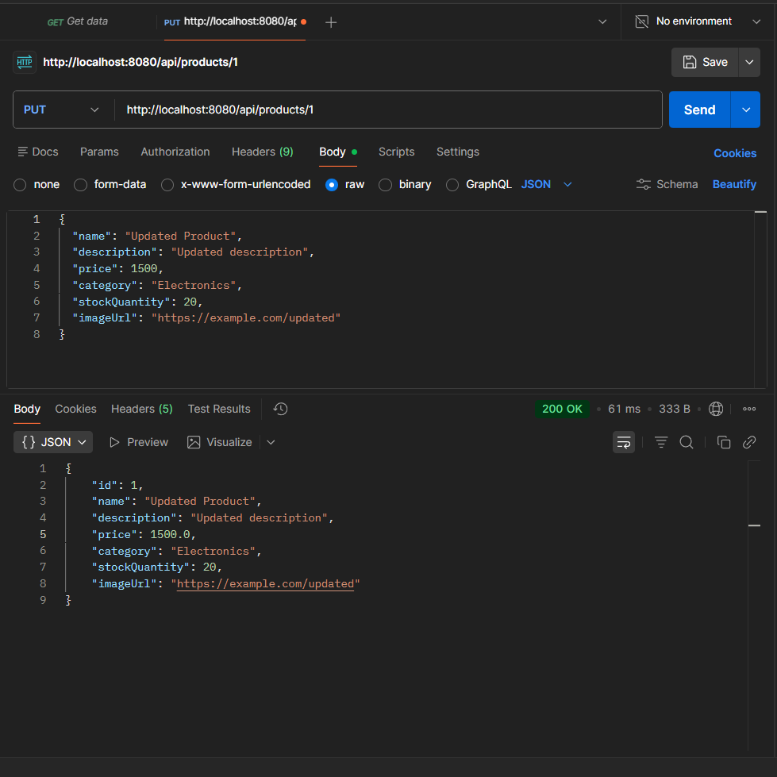
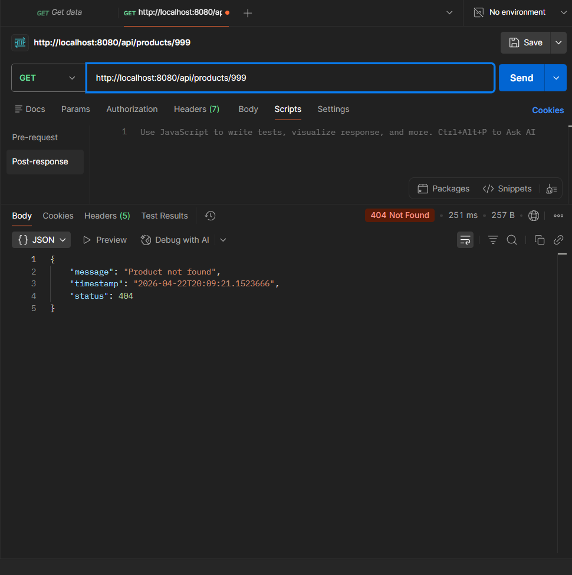

# 🛒 E-Commerce API

## 📌 Project Overview

This project is a RESTful API built using Spring Boot for our Laboratory 7.
It simulates a simple e-commerce backend where products can be created, viewed, updated, and deleted.

The goal of this project is to demonstrate:

* HTTP methods (GET, POST, PUT, DELETE)
* REST API design
* Proper status codes
* In-memory data storage (no database)

---

## 👨‍💻 Authors

* Carpio, Lyndel J.
* Cebuano, Irene

---

## ⚙️ Technologies Used

* Java 25
* Spring Boot 4.0.5
* Spring Web
* Lombok
* Gradle

---

## 🚀 How to Run the Application

1. Open the project in IntelliJ or VSCode
2. Make sure Java 25 is installed
3. Run the application:

```
./gradlew bootRun
```

4. Open browser or Postman:

```
http://localhost:8080/api/products
```

---

## 📡 API Endpoints

### 🔹 Get All Products

```
GET /api/products
```

Returns all products
Status: 200 OK

---

### 🔹 Get Product by ID

```
GET /api/products/{id}
```

Returns a specific product
Status: 200 OK / 404 Not Found

---

### 🔹 Create Product

```
POST /api/products
```

Sample Request Body:

```json
{
  "name": "Laptop",
  "description": "Gaming laptop",
  "price": 50000,
  "category": "Electronics",
  "stockQuantity": 10,
  "imageUrl": "https://example.com/laptop.jpg"
}
```

Status: 201 Created

---

### 🔹 Update Product

```
PUT /api/products/{id}
```

Updates the entire product
Status: 200 OK / 404 Not Found

---

### 🔹 Delete Product

```
DELETE /api/products/{id}
```

Deletes the product
Status: 204 No Content

---

### 🔹 Filter by Category

```
GET /api/products/filter/category?category=Electronics
```

---

### 🔹 Filter by Price

```
GET /api/products/filter/price?min=100&max=1000
```

---

## 🧪 Testing

The API was tested using Postman.

Test cases performed:

* Created at least 3 products
* Retrieved all products
* Retrieved product by ID
* Updated product using PUT
* Deleted product
* Filtered products by category and price
* Tested invalid ID (returns 404)

---

## 📸 API Testing Screenshots

### 🔹 Get All Products


### 🔹 Get Product by ID


### 🔹 Create Product


### 🔹 Update Product


### 🔹 Delete Product


### 🔹 Filter by Category


### 🔹 Filter by Price


### 🔹 Error Handling (404)


---

## 📊 API Summary

| Method | Endpoint           | Description        |
| ------ | ------------------ | ------------------ |
| GET    | /api/products      | Get all products   |
| GET    | /api/products/{id} | Get product by ID  |
| POST   | /api/products      | Create product     |
| PUT    | /api/products/{id} | Update product     |
| DELETE | /api/products/{id} | Delete product     |
| GET    | /filter/category   | Filter by category |
| GET    | /filter/price      | Filter by price    |

---

## ⚠️ Limitations

* Uses in-memory storage (data resets when the application restarts)
* No database integration
* No authentication

---

## 📝 Notes

This project uses in-memory storage, so all data will be lost when the application is restarted.

---

## ✅ Conclusion

This project successfully implements a RESTful API based on the requirements of Laboratory 7.
All CRUD operations and filtering features are working properly.
